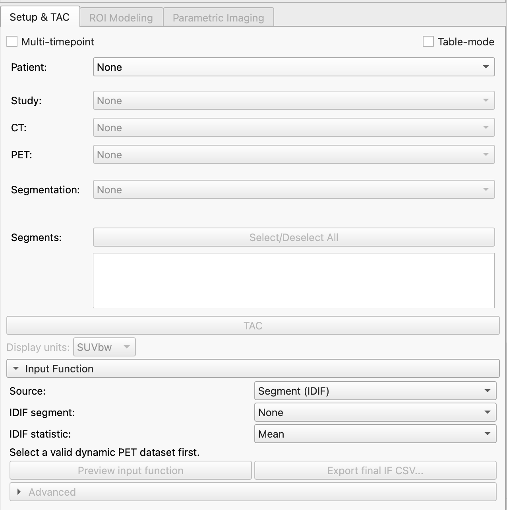

# SlicerDynamicPET

<p align="center">
  
</p>

**SlicerDynamicPET** is an open-source 3D Slicer extension for importing,
visualizing, and quantitatively analyzing **dynamic positron emission tomography
(PET)** data.

It combines dedicated dynamic PET DICOM import, regional and voxel-wise kinetic
modeling, parametric imaging, and dynamic RT Structure Set support in a single
Slicer-based workflow.

> **Status:** Beta / research software.  
> SlicerDynamicPET is under active development and should be independently
> validated for the datasets, scanners, tracers, reconstruction protocols, and
> quantitative workflows in which it is used.

---

## Included components

### DynamicPET

**DynamicPET** is the main analysis module of SlicerDynamicPET.

It provides tools for:

- working with dynamic PET Volume Sequences and tabulated time-activity curves;
- extracting regional time-activity curves from segmentations;
- graphical kinetic analysis;
- compartment-model fitting;
- relative and reference-region modeling where supported;
- voxel-wise kinetic modeling;
- generation and visualization of parametric images;
- analysis of dynamic acquisitions combined with delayed or static PET data.

DynamicPET uses
[KMAP-CPP](https://github.com/DanieleDallOlio/KMAP-CPP)
as its C++ kinetic-modeling backend.

KMAP-CPP is derived from the open-source
[KMAP-C Toolkit](https://github.com/ShareKM/KMAP-C).

### dPETImporter

**dPETImporter** provides the PET DICOM import layer.

It recognizes dynamic PET acquisitions and reconstructs them as time-resolved
**Slicer Volume Sequences** while preserving acquisition and quantitative
metadata required by downstream kinetic analysis.

Current functionality includes:

- 3D-per-frame dynamic PET datasets;
- 2D slice stacks grouped into temporal frames;
- frame timing extraction and preservation;
- optional SUVbw conversion when the required DICOM metadata are available;
- optional metadata-preserving loading of static / whole-body PET acquisitions;
- preservation of PET DICOM provenance used by downstream workflows;
- import of SlicerDynamicPET DICOM Parametric Map objects;
- integration with Slicer's DICOM and Sequences infrastructure.

dPETImporter is maintained independently at:

[dPETImporter](https://github.com/DanieleDallOlio/dPETImporter)

### dRTImporter

**dRTImporter** provides dynamic RT Structure Set support for temporal
segmentation workflows.

It can recognize supported temporal RTSTRUCT objects and reconstruct their ROI
states as **Slicer Segmentation Sequences**. It also provides the RTSTRUCT
export functionality used by SlicerDynamicPET for supported static and dynamic
PET workflows.

Dynamic RTSTRUCT handling uses a temporal reference convention in which DICOM
image references are associated with PET temporal frames. Because this is a
specialized dynamic workflow, interoperability with external systems should be
verified on the intended dataset and software environment.

dRTImporter relies on **SlicerRT** for Slicer RT segmentation infrastructure.

### KMAP-CPP

**KMAP-CPP** is the standalone C++ kinetic-modeling backend used by DynamicPET.

It is maintained separately from the Slicer user interface and can also be
built independently.

Repository:

[KMAP-CPP](https://github.com/DanieleDallOlio/KMAP-CPP)

---

## Main features

- Dynamic PET DICOM import
- Reconstruction of time-resolved Slicer Volume Sequences
- Frame timing and PET quantitative metadata preservation
- Optional SUVbw conversion during import
- Static / whole-body PET metadata support
- Regional time-activity curve extraction
- Graphical kinetic modeling
- Compartment-model fitting
- Relative/reference-region modeling where supported
- Voxel-wise parametric imaging
- DICOM Parametric Map import
- Dynamic segmentation / RTSTRUCT workflows
- Integration with Slicer segmentation, subject hierarchy, plotting, DICOM,
  Sequences, and visualization infrastructure
- Optional OpenMP acceleration when available

---

## Typical workflow

1. Import a PET study using the **DICOM** module.
2. Load the dynamic PET acquisition using **dPETImporter** as a Volume Sequence.
3. Define, import, or load regions of interest.
4. Extract regional time-activity curves.
5. Select the desired kinetic-modeling approach and input function.
6. Perform ROI-level graphical, compartmental, or relative modeling.
7. Generate voxel-wise parametric images when required.
8. Review fitted curves, kinetic parameters, and parametric volumes in Slicer.
9. When applicable, import or export temporal segmentation information using
   the dynamic RTSTRUCT workflow.

---

## Compatibility and validation

SlicerDynamicPET has been developed and **most extensively tested with
Total-Body dynamic PET data acquired on United Imaging systems**.

Dynamic PET DICOM organization and metadata may differ between scanner
manufacturers, scanner models, software versions, reconstruction protocols, and
export configurations. Although dPETImporter is designed to interpret standard
PET DICOM metadata conservatively, datasets from other systems may expose
unsupported metadata combinations or assumptions that require adaptation.

Particular care should be taken when interpreting:

- temporal frame identification and ordering;
- acquisition start times and frame durations;
- radiopharmaceutical administration time;
- decay-correction convention;
- image units and SUV type;
- injected activity and radionuclide half-life;
- patient weight;
- 3D-per-frame versus 2D-slices-per-frame organization;
- static / whole-body acquisition timing;
- spatial geometry and DICOM frame-of-reference information.

**Before quantitative analysis, users should verify that the reconstructed frame
order, frame timing, image units, decay correction, and SUV-related metadata
match the original acquisition.**

Support for additional vendors and DICOM organizations is very welcome. If a
dataset is not recognized correctly, produces unexpected timing or quantitative
metadata, or cannot be loaded, please report it so that the importer can be
improved.

---

## Reporting problems

Please open a GitHub issue if something does not behave as expected.

A useful report should include, when available:

- Slicer version;
- SlicerDynamicPET version or commit;
- operating system;
- scanner manufacturer and model;
- scanner / reconstruction software version;
- tracer;
- whether the acquisition is 3D-per-frame or 2D-slices-per-frame;
- expected and detected number of temporal frames;
- image units and decay-correction value;
- relevant anonymized DICOM metadata;
- steps required to reproduce the problem;
- Slicer error log or Python traceback.

### Patient privacy

**Do not upload identifiable clinical DICOM data or protected health
information to public GitHub issues.**

If a DICOM-reading problem requires an example dataset, use properly anonymized
data and verify the anonymization before sharing it.

---

## Contributing

Contributions, testing, and bug reports are welcome.

In particular, feedback from users working with PET systems, DICOM
organizations, tracers, and acquisition protocols that have not yet been tested
with SlicerDynamicPET is valuable.

Contributions may include:

- reports of unsupported DICOM organization or metadata;
- anonymized test datasets that can legally be shared;
- fixes for vendor-specific DICOM handling;
- validation of kinetic-modeling workflows;
- documentation improvements;
- bug fixes and new features.

---

## Installation

### Slicer Extensions Manager

SlicerDynamicPET is intended to be distributed through the
**3D Slicer Extensions Manager**.

Once the first public package is available, installation through the Extensions
Manager will be the recommended method.

### Development build

SlicerDynamicPET contains a C++ loadable module and therefore must be built
against a compatible 3D Slicer build.

The source tree contains the main module and bundled components:

```text
SlicerDynamicPET/
├── DynamicPET/
├── KMAP-CPP/
├── dPETImporter/
└── dRTImporter/
```

KMAP-CPP, dPETImporter, and dRTImporter are maintained as separable components
and integrated into SlicerDynamicPET for packaging and distribution.

---

## Dependencies

- **3D Slicer**
- **SlicerRT** for dRTImporter / RT Structure Set functionality
- **OpenMP** is optional and used for acceleration when available

DICOM Parametric Map import additionally uses the Python **highdicom** package.
If it is not already available in the Slicer Python environment, the current
Parametric Map importer installs its supported highdicom dependency on demand.

---

## OpenMP acceleration

SlicerDynamicPET can use **OpenMP** to accelerate computationally intensive
operations when OpenMP support is available.

OpenMP is optional. The extension is intended to remain functional without it
by falling back to serial implementations.

---

## Screenshots

<p align="center">
  
</p>

Useful additional screenshots for the project documentation may show:

- dynamic PET import through the Slicer DICOM browser;
- time-activity curves and kinetic fitting;
- voxel-wise parametric imaging;
- dynamic segmentation / RTSTRUCT workflows.

---

## Architecture

```text
SlicerDynamicPET
├── dPETImporter
│   └── PET DICOM import, timing/quantitative metadata, Volume Sequences
│
├── dRTImporter
│   └── dynamic RTSTRUCT / temporal segmentation support
│
├── DynamicPET
│   └── user interface, TAC handling, kinetic analysis, parametric imaging
│
└── KMAP-CPP
    └── standalone C++ kinetic-modeling backend
```

The separation between import, analysis, RT structure handling, and kinetic
modeling allows the individual components to be maintained independently while
SlicerDynamicPET provides the integrated end-user workflow.

---

## KMAP-CPP and upstream KMAP-C

The kinetic-modeling backend used by DynamicPET is
[KMAP-CPP](https://github.com/DanieleDallOlio/KMAP-CPP).

KMAP-CPP is a maintained C++ derivative of the
[Open KMAP-C Toolkit](https://github.com/ShareKM/KMAP-C).

The original KMAP-C copyright, authorship, attribution, and MIT licensing are
preserved in KMAP-CPP.

---

## Research use

SlicerDynamicPET is research software under active development.

It is **not a medical device** and is not intended to replace validated
clinical software. Quantitative results should be independently verified for
the datasets, tracers, kinetic models, and workflows in which the extension is
used.

---

## Citation

A publication specifically describing SlicerDynamicPET will be added here when
available.

When using SlicerDynamicPET in scientific work, please also cite **3D Slicer**
and, where appropriate, the original KMAP work and the methodological
publications corresponding to the kinetic models used in the analysis.

---

## License

Original code developed for SlicerDynamicPET is distributed under the
**MIT License**.

Third-party and derived components retain their respective copyright and
license notices. In particular:

- **KMAP-CPP** retains the upstream KMAP-C MIT license and attribution;
- **3D Slicer** retains its own software license;
- **SlicerRT** retains its own software license.

See [LICENSE](LICENSE) and the license files of bundled components for details.

---

## Author

**Daniele Dall'Olio**  
University of Bologna

- [GitHub](https://github.com/DanieleDallOlio)
- [University profile](https://www.unibo.it/sitoweb/daniele.dallolio)

---

## Acknowledgments

SlicerDynamicPET is built on the 3D Slicer platform and its MRML, DICOM,
Sequences, segmentation, plotting, and visualization infrastructure.

Thanks to the **Nuclear Medicine team at the Sant'Orsola Hospital in Bologna** for their support, feedback,
and testing throughout the development of SlicerDynamicPET, and especially to
**Irene Brusa**.

Dynamic RT Structure Set functionality integrates with the SlicerRT
infrastructure.

The kinetic-modeling backend builds upon the Open KMAP-C Toolkit. Original
KMAP-C contributors and the Open Kinetic Modeling Initiative are acknowledged
for the underlying kinetic-modeling framework.
